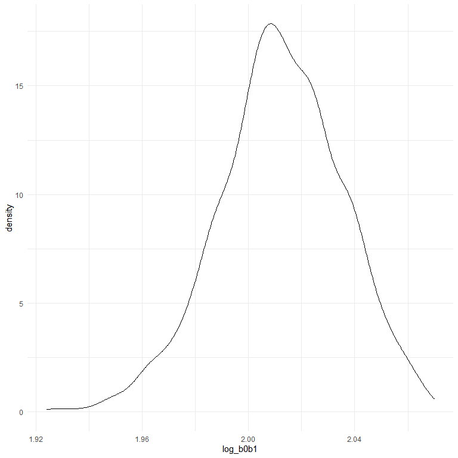
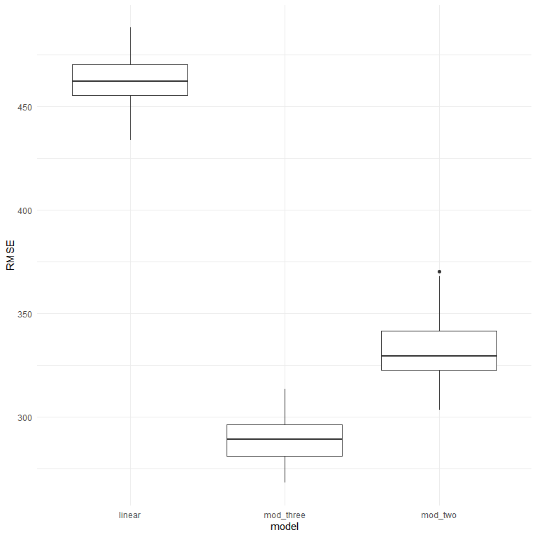

Homework 6
================
Ashwini Varghese
2022-12-03

## Problem 1

``` r
weather_df = 
  rnoaa::meteo_pull_monitors(
    c("USW00094728"),
    var = c("PRCP", "TMIN", "TMAX"), 
    date_min = "2017-01-01",
    date_max = "2017-12-31") %>%
  mutate(
    name = recode(id, USW00094728 = "CentralPark_NY"),
    tmin = tmin / 10,
    tmax = tmax / 10) %>%
  select(name, id, everything())
```

    ## Registered S3 method overwritten by 'hoardr':
    ##   method           from
    ##   print.cache_info httr

    ## using cached file: C:\Users\ashwi\AppData\Local/Cache/R/noaa_ghcnd/USW00094728.dly

    ## date created (size, mb): 2022-10-06 11:47:56 (8.428)

    ## file min/max dates: 1869-01-01 / 2022-10-31

``` r
weather_df %>% 
  modelr::bootstrap(n = 1000) %>% 
  mutate(
    models = map(strap, ~lm(tmax ~ tmin, data = .x) ),
    results = map(models, broom::glance)) %>% 
  select(-strap, -models) %>% 
  unnest(results) %>% 
  ggplot(aes(x = r.squared)) + geom_density()
```


``` r
weather_df %>% 
  modelr::bootstrap(n = 1000) %>% 
  mutate(
    models = map(strap, ~lm(tmax ~ tmin, data = .x) ),
    results = map(models, broom::tidy)) %>% 
  select(-strap, -models) %>% 
  unnest(results) %>% 
  select(id = `.id`, term, estimate) %>% 
  pivot_wider(
    names_from = term, 
    values_from = estimate) %>% 
  rename(beta0 = `(Intercept)`, beta1 = tmin) %>% 
  mutate(log_b0b1 = log(beta0 * beta1)) %>% 
  ggplot(aes(x = log_b0b1)) + geom_density()
```



## Problem 2

We will start by loading the homicide data.

``` r
homicides = read.csv("./homicide-data.csv")
```

Next we will do some data cleaning as below:

``` r
homicides =   
  homicides %>%
  unite("city_state", city:state, sep = ", ", remove = FALSE) %>% 
  mutate(solved = as.numeric(disposition == "Closed by arrest")) %>%
  filter(!(city %in% c("Dallas", "Phoenix", "Kansas City"))) %>%
  filter(city_state != "Tulsa, AL") %>%
  mutate(victim_age = as.numeric(victim_age)) %>%
  filter(victim_race %in% c("White", "Black")) %>%
  mutate(victim_race = fct_relevel(victim_race, "White")) %>%
  filter(victim_sex != "Unknown")
```

Now for just the city of Baltimore, we will fit a logistic model with
homicide being solved as the outcome and with victim age, sex, and race
as predictors.

``` r
Balt =
  homicides %>%
  filter(city == "Baltimore") %>%
  select(solved, victim_age, victim_race, victim_sex)

fit_balt = 
  Balt %>% 
  glm(solved ~ victim_age + victim_race + victim_sex, data = ., family = binomial()) 

fit_balt %>% 
  broom::tidy() %>%
  mutate(lower_CI = exp(estimate - 1.96*std.error),
         upper_CI = exp(estimate + 1.96*std.error),
         OR = exp(estimate)) %>%
  select(term, OR, lower_CI, upper_CI) %>% 
  knitr::kable(digits = 3)
```

| term             |    OR | lower_CI | upper_CI |
|:-----------------|------:|---------:|---------:|
| (Intercept)      | 3.164 |    1.989 |    5.031 |
| victim_age       | 0.993 |    0.987 |    1.000 |
| victim_raceBlack | 0.431 |    0.306 |    0.607 |
| victim_sexMale   | 0.426 |    0.325 |    0.558 |

Let’s repeat this for all the cities and get the OR with their 95% CI
for solving homicides comparing males to females, adjusting for race and
age.

``` r
homi_nest =
  homicides %>% 
  select(city_state, solved, victim_age, victim_race, victim_sex) %>% 
  relocate(city_state) %>% 
  nest(data = solved:victim_sex)


fit_all = 
  homi_nest %>% 
  mutate(
    models = map(.x = data, ~glm(solved ~ victim_age + victim_race + victim_sex, data = .x, family = binomial())),
    results = map(models, broom::tidy)) %>% 
  select(-data, -models) %>% 
  unnest(results) %>% 
  mutate(lower_CI = exp(estimate - 1.96*std.error),
         upper_CI = exp(estimate + 1.96*std.error),
         OR = exp(estimate)) %>%
  select(city_state, term, OR, lower_CI, upper_CI) %>%
  filter(term == "victim_sexMale")

fit_all %>%
  knitr::kable(digits = 3)
```

| city_state         | term           |    OR | lower_CI | upper_CI |
|:-------------------|:---------------|------:|---------:|---------:|
| Albuquerque, NM    | victim_sexMale | 1.767 |    0.831 |    3.761 |
| Atlanta, GA        | victim_sexMale | 1.000 |    0.684 |    1.463 |
| Baltimore, MD      | victim_sexMale | 0.426 |    0.325 |    0.558 |
| Baton Rouge, LA    | victim_sexMale | 0.381 |    0.209 |    0.695 |
| Birmingham, AL     | victim_sexMale | 0.870 |    0.574 |    1.318 |
| Boston, MA         | victim_sexMale | 0.667 |    0.354 |    1.260 |
| Buffalo, NY        | victim_sexMale | 0.521 |    0.290 |    0.935 |
| Charlotte, NC      | victim_sexMale | 0.884 |    0.557 |    1.403 |
| Chicago, IL        | victim_sexMale | 0.410 |    0.336 |    0.501 |
| Cincinnati, OH     | victim_sexMale | 0.400 |    0.236 |    0.677 |
| Columbus, OH       | victim_sexMale | 0.532 |    0.378 |    0.750 |
| Denver, CO         | victim_sexMale | 0.479 |    0.236 |    0.971 |
| Detroit, MI        | victim_sexMale | 0.582 |    0.462 |    0.734 |
| Durham, NC         | victim_sexMale | 0.812 |    0.392 |    1.683 |
| Fort Worth, TX     | victim_sexMale | 0.669 |    0.397 |    1.127 |
| Fresno, CA         | victim_sexMale | 1.335 |    0.580 |    3.071 |
| Houston, TX        | victim_sexMale | 0.711 |    0.558 |    0.907 |
| Indianapolis, IN   | victim_sexMale | 0.919 |    0.679 |    1.242 |
| Jacksonville, FL   | victim_sexMale | 0.720 |    0.537 |    0.966 |
| Las Vegas, NV      | victim_sexMale | 0.837 |    0.608 |    1.154 |
| Long Beach, CA     | victim_sexMale | 0.410 |    0.156 |    1.082 |
| Los Angeles, CA    | victim_sexMale | 0.662 |    0.458 |    0.956 |
| Louisville, KY     | victim_sexMale | 0.491 |    0.305 |    0.790 |
| Memphis, TN        | victim_sexMale | 0.723 |    0.529 |    0.988 |
| Miami, FL          | victim_sexMale | 0.515 |    0.304 |    0.872 |
| Milwaukee, wI      | victim_sexMale | 0.727 |    0.499 |    1.060 |
| Minneapolis, MN    | victim_sexMale | 0.947 |    0.478 |    1.875 |
| Nashville, TN      | victim_sexMale | 1.034 |    0.685 |    1.562 |
| New Orleans, LA    | victim_sexMale | 0.585 |    0.422 |    0.811 |
| New York, NY       | victim_sexMale | 0.262 |    0.138 |    0.499 |
| Oakland, CA        | victim_sexMale | 0.563 |    0.365 |    0.868 |
| Oklahoma City, OK  | victim_sexMale | 0.974 |    0.624 |    1.520 |
| Omaha, NE          | victim_sexMale | 0.382 |    0.203 |    0.721 |
| Philadelphia, PA   | victim_sexMale | 0.496 |    0.378 |    0.652 |
| Pittsburgh, PA     | victim_sexMale | 0.431 |    0.265 |    0.700 |
| Richmond, VA       | victim_sexMale | 1.006 |    0.498 |    2.033 |
| San Antonio, TX    | victim_sexMale | 0.705 |    0.398 |    1.249 |
| Sacramento, CA     | victim_sexMale | 0.669 |    0.335 |    1.337 |
| Savannah, GA       | victim_sexMale | 0.867 |    0.422 |    1.780 |
| San Bernardino, CA | victim_sexMale | 0.500 |    0.171 |    1.462 |
| San Diego, CA      | victim_sexMale | 0.413 |    0.200 |    0.855 |
| San Francisco, CA  | victim_sexMale | 0.608 |    0.317 |    1.165 |
| St. Louis, MO      | victim_sexMale | 0.703 |    0.530 |    0.932 |
| Stockton, CA       | victim_sexMale | 1.352 |    0.621 |    2.942 |
| Tampa, FL          | victim_sexMale | 0.808 |    0.348 |    1.876 |
| Tulsa, OK          | victim_sexMale | 0.976 |    0.614 |    1.552 |
| Washington, DC     | victim_sexMale | 0.691 |    0.469 |    1.018 |

Now we will make a plot showing the OR and 95% CI for each city.

``` r
fit_all %>% 
  mutate(city_state = fct_reorder(city_state, OR)) %>% 
  ggplot(aes(x = city_state, y = OR)) +        
    geom_point() +
    geom_errorbar(aes(ymin = lower_CI, ymax = upper_CI)) +
    theme(axis.text.x = element_text(angle = 80, hjust = 1))
```


From this plot, we can see the city with the lowest OR for solved
homicides comparing male victims to females while adjusting for race and
age is New York at 0.26 and the highest is Albuquerque at 1.77.

The interpretations are as follows:

In New York City, the odds of solving a homicide case for a male is 0.26
times the odds of solving a homicide case for a female, adjusting for
race and age. In Albuquerque, the odds of solving a homicide case for a
male is 1.77 times the odds of solving a homicide case for a female,
adjusting for race and age.

However, the confidence interval for Albuquerque includes the null value
of 1 making the OR not statistically significant whereas 1 is not in the
confidence interval for New York, which means the OR is statistically
significant. We would need to double check with the p-values.

## Problem 3

We will start by loading and cleaning the data in the following way:

``` r
children = read.csv("./birthweight.csv")

children = 
  children %>%
  janitor::clean_names() %>%
  mutate(babysex = recode(babysex,
                          "1" = "male",
                          "2" = "female"),
         babysex = factor(babysex, levels = c("male", "female")))
```

Now we will construct a regression model that predicts birthweight using
the given predictors in the dataset. I choose to use the variables
`gaweeks`, `ppbmi`, and `smoken`. I choose these variables because there
has been research and evidence that being overweight or obese, smoking,
and gestational age at birth can all have negative impacts on a baby’s
birthweight. When constructing plots to visually examine a relationship
between these variables and birthweight, there is not obvious
relationship that can be deciphered as seen below. However, for the
`gaweeks` variable, we can see somewhat of a linear relationship.

``` r
children %>%
  ggplot(aes(x = ppwt, y = bwt)) +
  geom_point()
```


``` r
children %>%
  ggplot(aes(x = smoken, y = bwt)) +
  geom_point()
```


``` r
children %>%
  ggplot(aes(x = gaweeks, y = bwt)) +
  geom_point()
```


Below is the model I have constructed and a plot of the residuals
vs. the fitted values. I have also plotted the true `bwt` values in red.
When you calculate the `rmse` for the model, the value is 456.66, which
is very high and tells us that for this model, the residuals are very
spread out and not very concentrated around the model regression line.

``` r
linear_mod = lm(bwt ~ gaweeks + ppwt + smoken, data = children)

children %>%
  add_predictions(linear_mod) %>%
  add_residuals(linear_mod, var = "resid") %>%
  ggplot(aes(x = pred, y = resid)) +
  geom_point() +
  geom_point(aes(y = bwt), color = "red")
```


``` r
rmse(linear_mod, children)
```

    ## [1] 456.6612

Now we will construct and compare my model to the 2 other models of
interest for this problem. The `rmse` values are still high but much
lower compared to my proposed model which shows an early indication that
they may better predict `bwt`.

``` r
mod_two = lm(bwt ~ blength + gaweeks, data = children)

mod_three = lm(bwt ~ babysex * blength * bhead, data = children)

rmse(linear_mod, children)
```

    ## [1] 456.6612

``` r
rmse(mod_two, children)
```

    ## [1] 333.1023

``` r
rmse(mod_three, children)
```

    ## [1] 287.4692

We will finish the comparison by using cross-validation as below:

``` r
cv_df = 
  crossv_mc(children, 100) %>%
  mutate(
    train = map(train, as_tibble),
    test =  map(test, as_tibble)
  ) %>%
  mutate(
    linear_fit =    map(.x = train, ~lm(bwt ~ gaweeks + ppbmi + smoken,  data = .x)),
    mod_two_fit =   map(.x = train, ~lm(bwt ~ blength + gaweeks,         data = .x)),
    mod_three_fit = map(.x = train, ~lm(bwt ~ babysex * blength * bhead, data = .x))
  ) %>%
  mutate(
    rmse_linear =    map2_dbl(.x = linear_fit,    .y = test, ~rmse(model = .x, data = .y)),
    rmse_mod_two =   map2_dbl(.x = mod_two_fit,   .y = test, ~rmse(model = .x, data = .y)),
    rmse_mod_three = map2_dbl(.x = mod_three_fit, .y = test, ~rmse(model = .x, data = .y)))


cv_df %>% 
  select(starts_with("rmse")) %>%
  pivot_longer(
    everything(),
    names_to = "model",
    values_to = "RMSE",
    names_prefix = "rmse_"
  ) %>% 
  ggplot(aes(x = model, y = RMSE)) +
    geom_boxplot()
```



According to the boxplots generated, we can see that the model with the
highest `rmse` value is my model and the one with the lowest is model
three with the interaction terms. This means that model three predicts
`bwt` best with its model line having the least amount of residual
deviation from the line of best fit. The best model to use would be
model 3.
